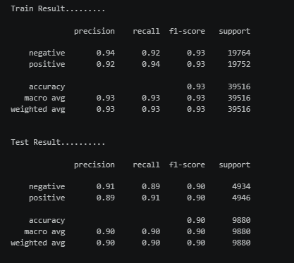
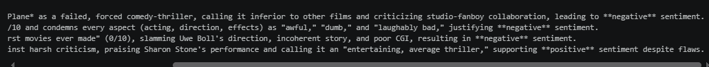

<div align="center">


# 🎬 IMDB Movie Review Sentiment Analysis


### 🚀 Sentiment Classification of Movie Reviews using Natural Language Processing

</div>

---

# 📖 Project Overview

This project implements a **Machine Learning-based Sentiment Analysis System** that automatically predicts whether an IMDB movie review expresses a **Positive** or **Negative** sentiment.

The project leverages **Natural Language Processing (NLP)** techniques, **TF-IDF Vectorization**, and **Logistic Regression** to classify movie reviews with high accuracy.

The trained model is saved using **Joblib** and can be used to predict the sentiment of unseen movie reviews.

---

# 🎯 Objective

Build an intelligent sentiment analysis model capable of accurately classifying IMDB movie reviews into:

- 😀 Positive
- 😞 Negative

using Natural Language Processing and Machine Learning.

---

# 📂 Project Structure

```text
IMDB_Sentiment_Analysis/
│
├── IMDB(1).ipynb              # Model Training Notebook
├── IMDB_Pred.ipynb            # Prediction Notebook
├── imdb_dataset.csv           # Dataset
├── imdb_sentiment_model.pkl   # Trained Model
└── README.md
```

---

# 📊 Dataset

The project uses the **IMDB Movie Review Dataset**, which contains thousands of movie reviews labeled as:

- Positive
- Negative

Each review is preprocessed before training the Machine Learning model.

---

# ⚙️ Machine Learning Workflow

```text
Movie Reviews
      │
      ▼
Data Cleaning
      │
      ▼
Text Preprocessing
      │
      ▼
Train-Test Split
      │
      ▼
TF-IDF Vectorization
      │
      ▼
Logistic Regression
      │
      ▼
Model Evaluation
      │
      ▼
Save Model (.pkl)
      │
      ▼
Predict Sentiment
```

---

# 🧠 Technologies Used

- Python
- Pandas
- NumPy
- Scikit-learn
- Joblib
- Jupyter Notebook

---

# 🤖 Machine Learning Model

### Algorithm

- Logistic Regression

### Feature Extraction

- TF-IDF Vectorizer

### Pipeline

- Text Cleaning
- TF-IDF Feature Extraction
- Logistic Regression Classifier

---

# 📝 Text Preprocessing

The following preprocessing steps are performed:

- Lowercase Conversion
- Removal of Punctuation
- Removal of Special Characters
- Stopword Removal
- TF-IDF Vectorization

---

# 📈 Model Evaluation

The model is evaluated using:

- Accuracy
- Precision
- Recall
- F1-Score
- Classification Report
- Confusion Matrix

---

# 📊 Results

## Classification Report

<p align="center">

</p>


## Sample Predictions

<p align="center">

</p>

---

# ✨ Features

- ✅ IMDB Movie Review Classification
- ✅ Sentiment Analysis
- ✅ NLP-based Text Classification
- ✅ TF-IDF Vectorization
- ✅ Logistic Regression
- ✅ Model Serialization using Joblib
- ✅ Predict Custom Movie Reviews
- ✅ High Accuracy Classification

---

# 🚀 Installation

Clone the repository

```bash
git clone https://github.com/SachinDevarajan/IMDB_Sentiment_Analysis.git
```

Move into the project

```bash
cd IMDB_Sentiment_Analysis
```

Install dependencies

```bash
pip install pandas numpy scikit-learn joblib notebook
```

---

# ▶️ Run the Project

Train the model

```bash
jupyter notebook IMDB(1).ipynb
```

Run prediction notebook

```bash
jupyter notebook IMDB_Pred.ipynb
```

---

# 🛠 Skills Demonstrated

- Machine Learning
- Natural Language Processing
- Sentiment Analysis
- Text Classification
- Feature Engineering
- TF-IDF Vectorization
- Logistic Regression
- Model Evaluation
- Python
- Scikit-learn
- Pandas

---

# 🔮 Future Improvements

- Hyperparameter Tuning
- Naive Bayes Comparison
- Support Vector Machine (SVM)
- Random Forest Classifier
- XGBoost
- Deep Learning (LSTM)
- Transformer Models (BERT)
- Streamlit Web Application
- Flask REST API
- Docker Deployment

---

# 📌 Applications

- Movie Review Analysis
- Customer Feedback Analysis
- Product Review Classification
- Opinion Mining
- Social Media Sentiment Analysis

---

# 🤝 Contributing

Contributions are welcome!

1. Fork this repository
2. Create a feature branch
3. Commit your changes
4. Push to your branch
5. Open a Pull Request

---

# 👨‍💻 Author

## Sachin Devarajan

**Data Analyst | Machine Learning Enthusiast**

📊 Passionate about Data Analytics, Machine Learning, and NLP.

💡 Building intelligent solutions using Python and Scikit-learn.

🌱 Currently learning Advanced Machine Learning, PySpark, and Data Engineering.

---

<div align="center">

## ⭐ If you found this project useful, please give it a Star!

### 💬 "Understanding human emotions through Machine Learning and Natural Language Processing."


</div>
